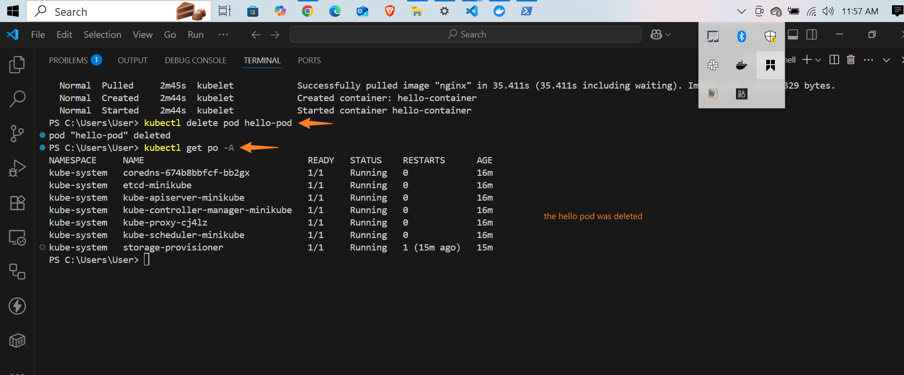

# 📦 Working with Kubernetes Pods

## 📝Project Overview

This project demonstrates how to **create, manage, and delete a Kubernetes Pod** using Minikube. It introduces the fundamental building blocks of Kubernetes — **Pods and Containers**, and walks through their lifecycle using kubectl, the Kubernetes CLI tool.

# 🧠 What Is a Pod?

In Kubernetes, a **Pod** is the **smallest and simplest deployable unit**. It can host one or more containers that:

- **Share the same network namespace**, meaning they can communicate via `localhost`.
- **Share storage volumes**, allowing data persistence between containers in the same pod.
Are scheduled together on the same node.

Typically, one container per pod is used (following the single responsibility principle), but multi-container pods are used when containers need to work tightly together (e.g., log sidecar + main app).

🚀 Pods are ephemeral — they are meant to be replaced, not modified. Hence, for production, you should usually use Deployments, not raw Pods.

# 🧪 Steps Performed

1. **Created a YAML manifest**
- File: `pod.yaml`
- Defines a single container pod running an `nginx` server.

2. **Applied the pod configuration**

``` bash
kubectl apply -f pod.yaml
```

3. **Listed pods across all namespaces**

``` bash
kubectl get po -A
```

4. **Described the pod to see details like events, IP, image, and resource usage**

``` bash
kubectl describe pod hello-pod
```

5. **Deleted the pod**

``` bash
kubectl delete pod hello-pod
```


# 📸 **Screenshots**





# 🧾  Key Takeaways and Reflections

- **Pods = Container Wrappers:** A pod acts as a wrapper around one or more containers, giving them shared resources like networking and volumes.
- **Pods Are Not Meant to Live Forever:** You should avoid manually managing pods in production — use `Deployments` or `ReplicaSets` instead.
- **YAML = Kubernetes DNA:** YAML configuration files are declarative and crucial for infrastructure as code. They define what the cluster should look like, not how to create it procedurally.
- **kubectl is your main tool:** From creation to inspection and deletion, kubectl is the primary interface to control your Kubernetes resources.


